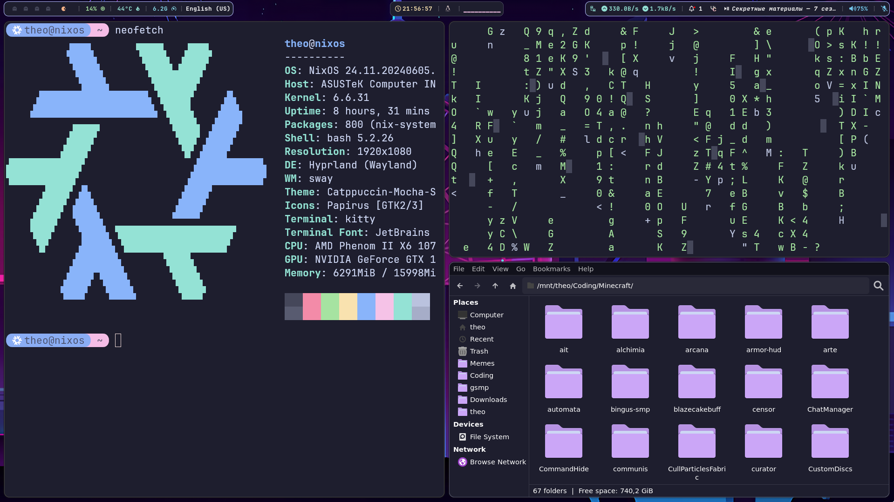

# How it all started
Back in February me and my good friend [Nik](https://github.com/NikSneMC) had a Discord call.
Was a good chat, but then he brought up Hyprland...

## How do people even find keyboard-only window management usable?!
...I thought to myself. There's no way it improves my productivity, if I can't have windows on top of each other!
Can't resize windows, can't move them. What even is this??

## But Nik's arguments were pretty solid...
And I wanted to re-do my Nix configuration for quite some time now so, after all, why not?


## The thing is...
I have a Nvidia GPU...
And if I wanted to do this I would do it on my favorite Linux distribution - [NixOS](https://nixos.org/).

So let's get started!


# Getting started
Having some experience with NixOS and Nix I quickly jumped into action and with Nik's and [Hyprland's Wiki](https://wiki.hyprland.org/Nix/) help I quickly got a basic configuration.
I used a flake setup. 

Then I set up [Home Manager](https://nixos.wiki/wiki/Home_Manager)...

## Everything was going great, but...
I installed Vesktop (Discord) and VSCodium, since I use those 2 apps quite frequently.
Both of them are based on Electron and both of them had terrible flickering. Frames would stutter, part of the frame moved the other still in place.
Horrible experience.

## Nvidia...
I couldn't give up so easily! So I asked Nik for help, and he told me to look at the wiki.
I followed [the guide](https://wiki.hyprland.org/Nvidia/) and flickering stopped.
(I use proprietary drivers btw).

## Wallpapers, status bar, all of that... Gone?
Yeahhh, Hyprland doesn't provide all that kind of stuff, so you have to install it yourself!
For the status bar I used [waybar](https://github.com/Alexays/Waybar), for notifications - [swaync](https://github.com/ErikReider/SwayNotificationCenter).
Also I installed [GNOME Keyring](https://wiki.gnome.org/Projects/GnomeKeyring) and [Mate Polkit](https://github.com/mate-desktop/mate-polkit) (since it actually looked decent).

For the desktop wallpapers I used [swww](https://github.com/LGFae/swww), for screenshots - [Grim](https://sr.ht/~emersion/grim/) + [Grimblast].

For the file manager I used [Thunar](https://docs.xfce.org/xfce/thunar/start) with [a few plugins](https://github.com/DrTheodor/nixos-dotfiles/blob/main/modules/hyprland/thunar/hm.nix#L9-L13).

## wow looks ugly
I know... So in Home Manager's config I set my icon theme to [Papirus](https://github.com/PapirusDevelopmentTeam/papirus-icon-theme) and my theme to [Catppuccin](https://github.com/catppuccin).

## But you see


And one of my favorite games is Minecraft. I quickly installed [Prism Launcher](https://prismlauncher.org/) (which, turns out, was a really good decision from the start! official minecraft launcher support was discontinued in nixpkgs).

Some versions worked out of the box, some required me to install a [patched version of GLFW](https://github.com/Admicos/minecraft-wayland) (aka minecraft-wayland package).

Then I decided to play a modded 1.20.1 modpack... I had TERRIBLE flickering. After killing my eyes for half a month and digging information for 2 weeks, 
I found out that it was the Nvidia's driver, and I wasn't even considering of switching to the open source one (not that I dislike open source, just the open source driver is not good enough imo).

In one of the reddit posts, some people said that this regression was to be observed in drivers version 535+.
So I decided to [downgrade my drivers](https://github.com/DrTheodor/nixos-dotfiles/blob/main/nvidia.nix#L42) to version 535, even though most people who attempted this in the same Reddit thread got their system bricked...
Aaaanyways, I took the risks.

I type in the command:
```bash
sudo nixos-rebuild switch
```

Restarting... And... It works! It actually works!
I start minecraft, no glitches. I open vesktop to tell Nik about it and..!

Oh no. 

Oh wait, I use flatpak for Vesktop, let me install it via Nix! And it works. No more flickering.


**Update as of 25th of August 2024**: new drivers seem to have fixed all the sync issues with new hyprland versions. Yippe!


# Outro
In the end, it took me quite some time to get this configuration done (1 whole week for the init setup, where it was usable enough), buuut I've got a functioning and stable system. Fancy stuff.
No flickering, no wayland + nvidia issues. 

The moral of the story is: never use flatpak on a Nix system, unless you're too lazy and never give up. I would say, "use Hyprland if you don't value your time", but I used NixOS for this configuration, 
so I'm sure that I won't have to re-do all of this work ever again.

Here's [the repo](https://github.com/DrTheodor/nixos-dotfiles) with my Nix configuration if you're interested. OH, also, I made it extremely simple to use!

Just clone the repo and change the settings in [this file](https://github.com/DrTheodor/nixos-dotfiles/blob/main/settings/general.nix) and configuration name in the [flake.nix](https://github.com/DrTheodor/nixos-dotfiles/blob/main/flake.nix).
Don't forget to create your own [user's file](https://github.com/DrTheodor/nixos-dotfiles/blob/main/users/theo.nix)!

Peace!

